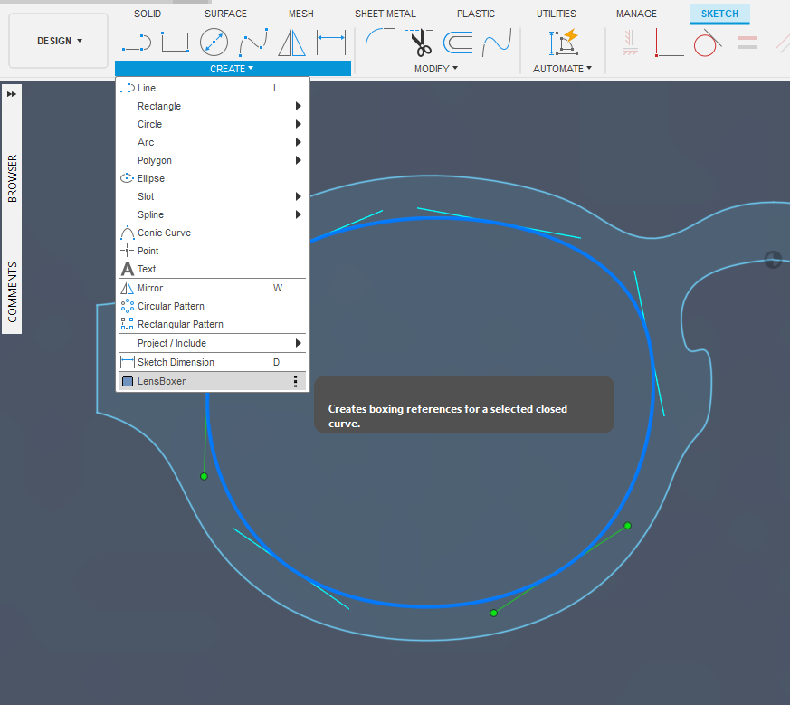
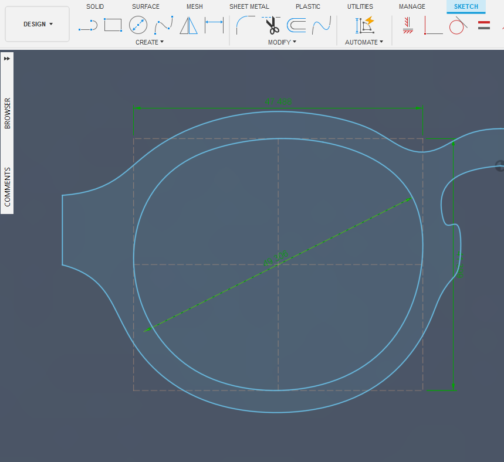

# How to Install the LensBoxer Add-In

### 1. Download and Unzip
Download the `.zip` file and unzip it. This will create a folder, for example `LensBoxer/`.

### 2. Copy the Add-In Folder
Copy the **entire** `LensBoxer/` folder into your Fusion 360 Add-Ins directory. The location depends on your operating system:

*   **Windows:**
    Copy the folder to:
    ```
    %APPDATA%\Autodesk\Autodesk Fusion 360\API\AddIns
    ```
    *(You can copy and paste the path above directly into the Windows Explorer address bar and press Enter.)*

*   **macOS:**
    Copy the folder to:
    ```
    ~/Library/Application Support/Autodesk/Autodesk Fusion 360/API/AddIns
    ```
    *(In Finder, click the **Go** menu, select **Go to Folder...**, and paste the path above.)*

### 3. Start Fusion 360
Start or restart Fusion 360. The Add-In will be loaded automatically.

### 4. Use the Add-In
The **"LensBoxer"** button will now be available in the **SKETCH** -> **CREATE** toolbar panel. 



The closed curve that makes up the eyewire must be selected prior to running **"LensBoxer"**. Upon running, the lens boxing measurement reference is gerenerated as construction lines. This includes dimensions for the A, B, and the ED of the lens.



To assign a hotkey:
1.  Hover over the "Boxer" button in the toolbar.
2.  Click the "three dots" `...` that appear on the right.
3.  Select **"Change Keyboard Shortcut..."**.
4.  Press your desired hotkey and click **OK**.
